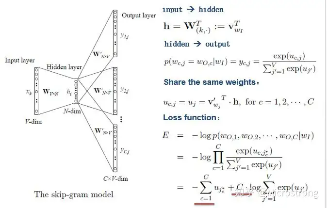

# 词向量 Word2Vec

## 1、介绍：

Word2Vec是Google于2013年开源推出的一个用于获取词向量（word vector）的工具包。它是语言模型中的一种，从大量文本预料中以无监督方式学习语义知识的模型，被广泛地应用于自然语言处理中。

自然语言处理相关任务中要将自然语言交给机器学习中的算法来处理，通常需要将语言数学化，因为计算机机器只认数学符号。向量是人把自然界的东西抽象出来交给机器处理的数学性质的东西，基本上可以说向量是人对机器输入的主要方式了。词向量是对词语的向量表示，这些向量能捕获词语的语义信息，如相似意义的单词具有类似的向量。

Word2Vec的主要作用是生成词向量，而词向量与语言模型有着密切的关系。Word2Vec的特点是能够将单词转化为向量来表示，这样词与词之间就可以定量的去度量他们之间的关系，挖掘词之间的联系。Word2Vec模型在自然语言处理中有着广泛的应用，包括词语相似度计算、文本分类、词性标注、命名实体识别、机器翻译、文本生成等。其主要目的是将所有词语投影到K维的向量空间，每个词语都可以用一个K维向量表示。

## 2、作用与目的：

词向量就是用来将语言中的词进行数学化的一种方式，顾名思义，词向量就是把一个词表示成一个向量。 我们都知道词在送到神经网络训练之前需要将其编码成数值变量，常见的编码方式有两种：One-Hot Representation 和 Distributed Representation。

Word2Vec模型的核心思想是通过词语的上下文信息来学习词语的向量表示。具体来说，Word2Vec模型通过训练一个神经网络模型，使得给定一个词语的上下文时，能够预测该词语本身（CBOW模型），或者给定一个词语时，能够预测其上下文（Skip-gram模型）。Word2Vec的训练模型本质上是只具有一个隐含层的神经元网络。它的输入是采用One-Hot编码的词汇表向量，它的输出也是One-Hot编码的词汇表向量。使用所有的样本，训练这个神经元网络，等到收敛之后，从输入层到隐含层的那些权重，便是每一个词的采用Distributed Representation的词向量。

## 3、词向量

自然语言处理相关任务中要将自然语言交给机器学习中的算法来处理，通常需要将语言数学化，因为机器不是人，机器只认数学符号。向量是人把自然界的东西抽象出来交给机器处理的东西，基本上可以说向量是人对机器输入的主要方式了。

词向量就是用来将语言中的词进行数学化的一种方式，顾名思义，词向量就是把一个词表示成一个向量。 我们都知道词在送到神经网络训练之前需要将其编码成数值变量，常见的编码方式有两种：One-Hot Representation 和 Distributed Representation。

### **3.1 One-Hot Representation**

一种最简单的词向量方式是One-Hot编码 ，就是用一个很长的向量来表示一个词，向量的长度为词典的大小，向量中只有一个 1 ， 其他全为 0 ，1 的位置对应该词在词典中的位置。

举个例子：I like writing code，那么转换成独热编码就是:

I:1 0 0 0

like: 0 1 0 0

writing:0 0 1 0

code:0 0 0 1

这种One Hot编码如果采用稀疏方式存储，会是非常的简洁：也就是给每个 词分配一个数字 ID 。比如上面的例子中，code记为 1 ，like记为 4 。 如果要编程实现的话，用 Hash 表给每个词分配一个编号就可以了。这么简洁的表示方法配 合上最大熵、 SVM 、 CRF 等等算法已经能很好地完成 NLP 领域的各种主流任务。

但这种词表示有两个缺点：

❝ （1）容易受维数灾难的困扰，尤其是将其用于 Deep Learning的一些算法时；
❞

当你的词汇量达到千万甚至上亿级别的时候,你会遇到一个更加严重的问题,维度爆炸了.这里举例使用的是4个词,你会发现,我们使用了四个维度,当词数量达到1千万的时候,词向量的大小变成了1千万维,不说别的,光内存你都受不了这么大的词向量,假设你使用一个bit来表示每一维,那么一个单词大概需要0.12GB的内存,但是注意这只是一个词,一共会有上千万的词,这样内存爆炸了

❝ （ 2 ）词汇鸿沟，不能很好地刻画词与词之间的相似性；
❞

任意两个词之间都是孤立的，从这两个向量中看不出两个词是否有关系。比如说，I、like之间的关系和like、writing之间的关系,通过0001和0010和0010和0100怎么表现,通过距离?通过1的位置?你会发现独热编码完全没法表现单词之间的任何关系。

❝ （3）强稀疏性；
❞

当维度过度增长的时候,你会发现0特别多,这样造成的后果就是整个向量中有用的信息特别少,几乎就没法做计算。

由于One-hot编码存在以上种种问题，所以研究者就会寻求发展，用另外的方式表示，就是Distributed Representation。

### **3.2 Distributed Representation**

Distributed Representation最早是Hinton于1986年提出的，可以克服One-Hot Representation的上述缺点。其基本想法是：通过训练将某种语言中的每一个词 映射成一个固定长度的短向量（当然这里的“短”是相对于One-Hot Representation的“长”而言的），所有这些向量构成一个词向量空间，而每一个向量则可视为 该空间中的一个点，在这个空间上引入“距离”，就可以根据词之间的距离来判断它们之间的语法、语义上的相似性了。Word2Vec中采用的就是这种Distributed Representation 的词向量。

为什么叫做 Distributed Representation？很多人问到这个问题。一个简单的解释是这样的：对于One-Hot Representation，向量中只有一个非零分量，非常 集中（有点孤注一掷的感觉）；而对于Distributed Representation，向量中有大量非零分量，相对分散（有点风险平摊的感觉），把词的信息分布到各个分量 中去了。这一点，跟并行计算里的分布式并行很像。

如何获取词向量呢？有很多不同模型可以用来估计词向量，包括有名的LSA（Latent Semantic Analysis）和LDA（Latent Dirichlet Allocation）。此外，利用神经 网络算法也是一种常用的方法，上一节介绍的神经概率语言模型就是一个很好的实例。当然，在那个模型中，目标是生成语言模型，词向量只是一个副产品。事实上， 大部分情况下，词向量和语言模型都是捆绑在一起的，训练完成后两者同时得到。在用神经网络训练语言模型方面，最经典的论文就是Bengio于2003年发表的《A Neural Probabilistic Language Model》 ，其后有一系列相关的研究工作，其中也包括谷歌Tomas Mikolov团队的Word2Vec。

## **4、Word2Vec的网络结构**

Word2Vec是轻量级的神经网络，其模型仅仅包括输入层、隐藏层和输出层，模型楂架根据瀭入输出的不同。Word2Vec包括两种模型: 主要包括CBOW和Skip-gram模型。CBOW的方式是在知道词 $w_t$ 的上下文 $w_{t-2}, w_{t-1}, w_{t+1}, w_{t+2}$ 的情况下预测当前词 $w_t$. 而Skip-gram是在知道了词 $w_t$ 的情况下, 对词 $w_t$ 的上下 文 $w_{t-2}, w_{t-1}, w_{t+1}, w_{t+2}$ 进行预测，如下图所示:

CBOW模型是根据上下文去预测目标词来训练得到词向量，而Skip-gram模型则是根据目标词去预测上下文来训练得到词向量。CBOW适合于数据集较小的情况，而Skip-Gram在大型语料中表现更好。

### **4.1 CBOW**

#### **4.1.1 Simple CBOW Model**

为了更好的了解模型深处的原理，我们先从Simple CBOW model（仅输入一个词，输出一个词）框架说起

如上图所示:

- input layer输入的 X 是单词的one-hot representation（考虑一个词表 V ，里面的每一个词 $w_i$ 都有一个编芌 $\mathrm{i} \in\{1, \ldots,|\mathrm{V}|\}$ ，那么词 $w_i$ 的one-hot表示就是一个维度为 $|\mathrm{V}|$ 的向量，其中第 i 个元素值非零，其余元素全为 0 ，例如: $\left.w_2=[0,1,0, \ldots, 0]^T\right)$ ；
- 输入层到除藏层之间有一个权重矩阵W，隐藏层得到的值是由输入X乘上权重矩阵得到的（细心的人会发现，0-1向量乘上一个矩阵，就相当于选择了权重矩阵的某一行，如图：输入的向量X是 $[0,0,1 ， 0 ， 0 ， 0] ， W$ 的转置乘上X就相当于从矩阵中选择第 3 行 $[2,1,3]$ 作为隐藏层的值) ；
- 隐藏层到输出层也有一个权重矩阵 ${ }^{\prime}$ '，因此，输出层向量 $y$ 的每一个值，其实就是隐荡层的向量点乘权重向量 ${ }^{\prime}{ }^{\prime}$ 的每一列，比如输出层的第一个数 7 ，就是向量 $[2,1,3]$ 和列向量 $[1,2,1]$ 点乘之后的结果;
- 最终的输出需要经过softmax函数，将输出向量中的每一个元素归一化到0-1之间的概率，概率最大的，就是预测的词。

了解了Simple CBOW model的模型堐架之后, 我们来学习一下其目标函数。

$$
\begin{aligned}
L & =\max \log p(w \mid \operatorname{Context}(w)) \\
& =\max \log \left(y_j^*\right) \\
& =\max \log \left(\frac{\exp \left(u_j^*\right)}{\sum \exp \left(u_k\right)}\right)
\end{aligned}
$$

输出层通过softmax归一化，u代表的是输出层的原始结果。㣂过下面公式，我们的目标函数可以转化为现在这个形式

$$
\begin{gathered}
a^{\log a(N)}=N \\
\max \log \left(\frac{\exp \left(u_j^*\right)}{\sum \exp \left(u_k\right)}\right)=\max u_j^*-\log \sum_{k=1}^V \exp \left(u_k\right)
\end{gathered}
$$

### **4.2 Skip-gram Model**

有了CBOW的介绍，对于Skip-gram model 的理解应该会更快一些。

如上图所示，Skip-gram model是通过输入一个词去预测多个词的概率。输入层到隐藏层的原理和simple CBOW一样，不同的是隐藏层到输出层，损失函数变成了C个词损失函数的总和，权重矩阵W'还是共享的。

一般神经网络语言模型在预测的时候，输出的是预测目标词的概率，也就是说我每一次预测都要基于全部的数据集进行计算，这无疑会带来很大的时间开销。不同于其他神经网络，Word2Vec提出两种加快训练速度的方式，一种是Hierarchical softmax，另一种是Negative Sampling。

## **关于Word2Vec若干问题的思考**

（1）Word2Vec两个算法模型的原理是什么，网络结构怎么画？

（2）网络输入输出是什么？隐藏层的激活函数是什么？输出层的激活函数是什么？

（3）目标函数/损失函数是什么？

（4）Word2Vec如何获取词向量？

（5）推导一下Word2Vec参数如何更新？

（6）Word2Vec的两个模型哪个效果好哪个速度快？为什么？

（7）Word2Vec加速训练的方法有哪些？

（8）介绍下Negative Sampling，对词频低的和词频高的单词有什么影响？为什么？

（9）Word2Vec和隐狄利克雷模型(LDA)有什么区别与联系？

以上问题可以通过本文和参考文章找到答案，这里不再详细解答。

（10）介绍下Hierarchical Softmax的计算过程，怎么把 Huffman 放到网络中的？参数是如何更新的？对词频低的和词频高的单词有什么影响？为什么？

Hierarchical Softmax利用了Huffman树依据词频建树，词频大的节点离根节点较近，词频低的节点离根节点较远，距离远参数数量就多，在训练的过程中，低频词的路径上的参数能够得到更多的训练，所以效果会更好。

（11）Word2Vec有哪些参数，有没有什么调参的建议？

* Skip-Gram 的速度比CBOW慢一点，小数据集中对低频次的效果更好；
* Sub-Sampling Frequent Words可以同时提高算法的速度和精度，Sample 建议取值为 [10−5,10−3] ；
* Hierarchical Softmax对低词频的更友好；
* Negative Sampling对高词频更友好；
* 向量维度一般越高越好，但也不绝对；
* Window Size，Skip-Gram一般10左右，CBOW一般为5左右。

（12）Word2Vec有哪些局限性？

Word2Vec作为一个简单易用的算法，其也包含了很多局限性：

* Word2Vec只考虑到上下文信息，而忽略的全局信息；
* Word2Vec只考虑了上下文的共现性，而忽略的了彼此之间的顺序性；
