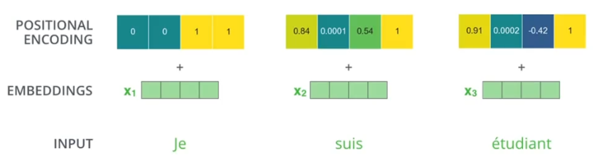
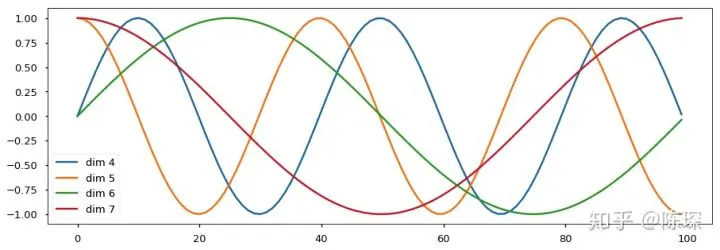

# Transformer原理及介绍

## 1. 输入 BPE+PE



### 1.1 Byte Pair Encoding(BPE)

输入是embadding，单词的 Embedding （嵌入向量） 有很多种方式可以获取，例如可以采用 Word2Vec、Glove 等算法预训练得到，也可以在 Transformer 中训练得到。

https://www.jianshu.com/p/e6b5b463cf7b

```
self.embedding           = nn.Embedding(vocab_size, d_model)
```

### **1.2 Positional Encoding (PE)**

经过word embedding,我们获得了词与词之间关系的表达形式，但是词在句子中的位置关系还无法体现，由于Transformer是并行地处理句子中的所有饲，于是需要加入词在句子中的位置信息，结合了这种方式的词嵌入就是Position Embedding了。

那么具体该怎么做？我们通常容易想到两种方式：1、通过网络来学习；2、预定义一个函数，通过函数计算出位置信息：

Transformer的作者对以上两种方式都做了探究，发现最终效果相当，于是采用了第2种方式，从而减少模型参数量，同时还能适应即使在训练集中没有出现过的句子长度。计算位置信息的函数计算公式如下：

$$
\begin{gathered}
P E_{(p o s, 2 i)}=\sin \left(p o s / 10000^{2 i / d}\right) \\
P E_{(p o s, 2 i+1)}=\cos \left(p o s / 10000^{2 i / d}\right)
\end{gathered}
$$

pos代表的是词在句子中的位置，d是词向量的维度（通常经过word embedding后是512），2i代表的是d中的偶数维度，2ⅰ+1则代表的是奇数维度，这种计算方式使得每一维都对应一个正弦曲线。



**为何使用三角函数呢？**

由于三角函数的性质：sin(a+b)=sin(a)cos(b)+cos(a)sin(b)、cos(a+b)=cos(a)Cos(b)-sin()sin(b),于是，对于位置pos+k处的信息，可以由pos位置计算得到，作者认为这样可以让模型更容易地学习到位置信息。

**为何使用这种方式编码能够代表不同位置信息呢？**

由公式可知，每一维 $i$ 都对应不同周期的正余弦曲线： $i=0$ 时是周期为 $2 \pi$ 的 $\sin$ 函数， $i=1$ 时是周期为 $2 \pi$ 的 $\cos$ 函数. 对于不同的两个位置 $\operatorname{pos} 1$ 知 $\operatorname{pos} 2$ ，若它们在某一维 $i$ 上有相同的编码值，则说明这两个位置的差值等于该维所在曲线的周期，即 $|\operatorname{pos} 1-\operatorname{pos} 2|=T_i$ 。而对于另一个维度 $j(j \neq i)$ ，由于 $T_j \neq T_i$ ，因此 pos 1 紷 pos 2 在这个维度 $j$ 上的编码值就不会相等，对于其它任意 $k \in\{0,1,2, . ., d-1\} ; k \neq i$ 也是如此。

综上可知，这种编码方式保证了不同位置在所有维度上不会被编码到完全一样的值，从而使每个位置都获得独一无二的编码。

pytorch代码实现如下：

```python

class PositionalEncoding(nn.Module):
    "实现位置编码"
    def __init__(self, d_model, dropout, max_len=5000):
        super(PositionalEncoding, self).__init__()
        self.dropout = nn.Dropout(p=dropout)

        # 初始化Shape为(max_len, d_model)的PE (positional encoding)
        pe = torch.zeros(max_len, d_model).to(device)
  
        # 初始化一个tensor [[0, 1, 2, 3, ...]]
        position = torch.arange(0, max_len).unsqueeze(1)
        # 这里就是sin和cos括号中的内容，通过e和ln进行了变换
        div_term = torch.exp(torch.arange(0, d_model, 2) * -(math.log(10000.0) / d_model))
  
        pe[:, 0::2] = torch.sin(position * div_term) # 计算PE(pos, 2i)
        pe[:, 1::2] = torch.cos(position * div_term) # 计算PE(pos, 2i+1)
  
        pe = pe.unsqueeze(0) # 为了方便计算，在最外面在unsqueeze出一个batch
  
        # 如果一个参数不参与梯度下降，但又希望保存model的时候将其保存下来
        # 这个时候就可以用register_buffer
        self.register_buffer("pe", pe)

    def forward(self, x):
        """
        x 为embedding后的inputs，例如(1,7, 128)，batch size为1,7个单词，单词维度为128 输入的尺寸一定为（1，——，d_model）
        """
        # 将x和positional encoding相加。
        x = x + self.pe[:, :x.size(1)].requires_grad_(False)
        return self.dropout(x)
```

## Encoder

### MultiHeadAttention

```python
class MultiHeadAttention(nn.Module):
    # n_heads：多头注意力的数量
    # hid_dim：每个词输出的向量维度
    def __init__(self, hid_dim, n_heads):
        super(MultiHeadAttention, self).__init__()
        self.hid_dim = hid_dim
        self.n_heads = n_heads

        # 强制 hid_dim 必须整除 h
        assert hid_dim % n_heads == 0
        # 定义 W_q 矩阵
        self.w_q = nn.Linear(hid_dim, hid_dim)
        # 定义 W_k 矩阵
        self.w_k = nn.Linear(hid_dim, hid_dim)
        # 定义 W_v 矩阵
        self.w_v = nn.Linear(hid_dim, hid_dim)
        self.fc  = nn.Linear(hid_dim, hid_dim)
        # 缩放
        self.scale = torch.sqrt(torch.FloatTensor([hid_dim // n_heads]))

    def forward(self, query, key, value, mask=None):
        # 注意 Q，K，V的在句子长度这一个维度的数值可以一样，可以不一样。
        # K: [64,10,300], 假设batch_size 为 64，有 10 个词，每个词的 Query 向量是 300 维
        # V: [64,10,300], 假设batch_size 为 64，有 10 个词，每个词的 Query 向量是 300 维
        # Q: [64,12,300], 假设batch_size 为 64，有 12 个词，每个词的 Query 向量是 300 维
        bsz = query.shape[0]
        Q = self.w_q(query)
        K = self.w_k(key)
        V = self.w_v(value)
        # 这里把 K Q V 矩阵拆分为多组注意力
        # 最后一维就是是用 self.hid_dim // self.n_heads 来得到的，表示每组注意力的向量长度, 每个 head 的向量长度是：300/6=50
        # 64 表示 batch size，6 表示有 6组注意力，10 表示有 10 词，50 表示每组注意力的词的向量长度
        # K: [64,10,300] 拆分多组注意力 -> [64,10,6,50] 转置得到 -> [64,6,10,50]
        # V: [64,10,300] 拆分多组注意力 -> [64,10,6,50] 转置得到 -> [64,6,10,50]
        # Q: [64,12,300] 拆分多组注意力 -> [64,12,6,50] 转置得到 -> [64,6,12,50]
        # 转置是为了把注意力的数量 6 放到前面，把 10 和 50 放到后面，方便下面计算
        Q = Q.view(bsz, -1, self.n_heads, self.hid_dim //
                   self.n_heads).permute(0, 2, 1, 3)
        K = K.view(bsz, -1, self.n_heads, self.hid_dim //
                   self.n_heads).permute(0, 2, 1, 3)
        V = V.view(bsz, -1, self.n_heads, self.hid_dim //
                   self.n_heads).permute(0, 2, 1, 3)

        # 第 1 步：Q 乘以 K的转置，除以scale
        # [64,6,12,50] * [64,6,50,10] = [64,6,12,10]
        # attention：[64,6,12,10]
        attention = torch.matmul(Q, K.permute(0, 1, 3, 2)) / self.scale

        # 如果 mask 不为空，那么就把 mask 为 0 的位置的 attention 分数设置为 -1e10，这里用“0”来指示哪些位置的词向量不能被attention到，比如padding位置，当然也可以用“1”或者其他数字来指示，主要设计下面2行代码的改动。
        if mask is not None:
            attention = attention.masked_fill(mask == 0, -1e10)

            # 第 2 步：计算上一步结果的 softmax，再经过 dropout，得到 attention。
            # 注意，这里是对最后一维做 softmax，也就是在输入序列的维度做 softmax
            # attention: [64,6,12,10]
        attention = torch.softmax(attention, dim=-1)

        # 第三步，attention结果与V相乘，得到多头注意力的结果
        # [64,6,12,10] * [64,6,10,50] = [64,6,12,50]
        # x: [64,6,12,50]
        x = torch.matmul(attention, V)

        # 因为 query 有 12 个词，所以把 12 放到前面，把 50 和 6 放到后面，方便下面拼接多组的结果
        # x: [64,6,12,50] 转置-> [64,12,6,50]
        x = x.permute(0, 2, 1, 3).contiguous()
        # 这里的矩阵转换就是：把多组注意力的结果拼接起来
        # 最终结果就是 [64,12,300]
        # x: [64,12,6,50] -> [64,12,300]
        x = x.view(bsz, -1, self.n_heads * (self.hid_dim // self.n_heads))
        x = self.fc(x)
        return x

```

## Decoder

同样的结构，加了基于掩码的attention。

整体结构


```python
import torch
import torch.nn as nn
import math

# 指定设备
device = torch.device("cuda" if torch.cuda.is_available() else "cpu")
class MultiHeadAttention(nn.Module):
    # n_heads：多头注意力的数量
    # hid_dim：每个词输出的向量维度
    def __init__(self, hid_dim, n_heads):
        super(MultiHeadAttention, self).__init__()
        self.hid_dim = hid_dim
        self.n_heads = n_heads

        # 强制 hid_dim 必须整除 h
        assert hid_dim % n_heads == 0
        # 定义 W_q 矩阵
        self.w_q = nn.Linear(hid_dim, hid_dim)
        # 定义 W_k 矩阵
        self.w_k = nn.Linear(hid_dim, hid_dim)
        # 定义 W_v 矩阵
        self.w_v = nn.Linear(hid_dim, hid_dim)
        self.fc  = nn.Linear(hid_dim, hid_dim)
        # 缩放
        self.scale = torch.sqrt(torch.FloatTensor([hid_dim // n_heads]))

    def forward(self, query, key, value, mask=None):
        # 注意 Q，K，V的在句子长度这一个维度的数值可以一样，可以不一样。
        # K: [32,10,512], 假设batch_size 为 32，有 10 个词，每个词的 K 向量是 512 维
        # V: [32,10,512], 假设batch_size 为 32，有 10 个词，每个词的 V 向量是 512 维
        # Q: [32,10,512], 假设batch_size 为 32，有 10 个词，每个词的 Q 向量是 512 维
        # k*x  v*x  w*x
        bsz = query.shape[0]
        Q = self.w_q(query)
        K = self.w_k(key)
        V = self.w_v(value)
        # 这里把 K Q V 矩阵拆分为多组注意力
        # 最后一维就是是用 self.hid_dim // self.n_heads 来得到的，表示每组注意力的向量长度, 每个 head 的向量长度是：512/8=64
        # 32 表示 batch size，8 表示有 8组注意力，10 表示有 10 词，64 表示每组注意力的词的向量长度
        # K: [32,10,512] 拆分多组注意力 -> [32,10,8,64] 转置得到 -> [32,8,10,64]
        # V: [32,10,512] 拆分多组注意力 -> [32,10,8,64] 转置得到 -> [32,8,10,64]
        # Q: [32,10,512] 拆分多组注意力 -> [32,10,8,64] 转置得到 -> [32,8,10,64]
        # 转置是为了把注意力的数量 8 放到前面，把 10 和 64 放到后面，方便下面计算
        Q = Q.view(bsz, -1, self.n_heads, self.hid_dim //
                   self.n_heads).permute(0, 2, 1, 3)
        K = K.view(bsz, -1, self.n_heads, self.hid_dim //
                   self.n_heads).permute(0, 2, 1, 3)
        V = V.view(bsz, -1, self.n_heads, self.hid_dim //
                   self.n_heads).permute(0, 2, 1, 3)

        # 第 1 步：Q 乘以 K的转置，除以scale
        # [32,8,10,64] * [32,8,64,10] = [32,8,10,10]
        # attention：[32,8,10,10]
        attention = torch.matmul(Q, K.permute(0, 1, 3, 2)) / self.scale

        # 如果 mask 不为空，那么就把 mask 为 0 的位置的 attention 分数设置为 -1e10，这里用“0”来指示哪些位置的词向量不能被attention到，比如padding位置，当然也可以用“1”或者其他数字来指示，主要设计下面2行代码的改动。
        if mask is not None:
            attention = attention.masked_fill(mask == 0, -1e10)

            # 第 2 步：计算上一步结果的 softmax，再经过 dropout，得到 attention。
            # 注意，这里是对最后一维做 softmax，也就是在输入序列的维度做 softmax
            # attention: [32,8,10,10]
        attention = torch.softmax(attention, dim=-1)   #softmax((Q*K)/scale)

        # 第三步，attention结果与V相乘，得到多头注意力的结果
        # [32,8,10,10] * [32,8,10,64] = [32,8,10,64]
        # x: [32,8,10,64]
        x = torch.matmul(attention, V)

        # 因为 query 有 10 个词，所以把 10 放到前面，把 64 和 8 放到后面，方便下面拼接多组的结果
        # x: [32,8,10,64] 转置-> [32,10,8,64]
        x = x.permute(0, 2, 1, 3).contiguous()
        # 这里的矩阵转换就是：把多组注意力的结果拼接起来
        # 最终结果就是 [32,10,512]
        # x: [32,10,8,64] -> [32,10,512]
        x = x.view(bsz, -1, self.n_heads * (self.hid_dim // self.n_heads))
        x = self.fc(x)
        return x
class Feedforward(nn.Module):
    def __init__(self, d_model, d_ff, dropout=0.1):
        super(Feedforward, self).__init__()
        # 两层线性映射和激活函数ReLU
        self.linear1 = nn.Linear(d_model, d_ff)
        self.dropout = nn.Dropout(dropout)
        self.linear2 = nn.Linear(d_ff, d_model)

    def forward(self, x):
        x = torch.nn.functional.relu(self.linear1(x))
        x = self.dropout(x)
        x = self.linear2(x)
        return x
class PositionalEncoding(nn.Module):
    "实现位置编码"
    def __init__(self, d_model, dropout, max_len=5000):
        super(PositionalEncoding, self).__init__()
        self.dropout = nn.Dropout(p=dropout)

        # 初始化Shape为(max_len, d_model)的PE (positional encoding)
        pe = torch.zeros(max_len, d_model).to(device)
      
        # 初始化一个tensor [[0, 1, 2, 3, ...]]
        position = torch.arange(0, max_len).unsqueeze(1)
        # 这里就是sin和cos括号中的内容，通过e和ln进行了变换
        div_term = torch.exp(torch.arange(0, d_model, 2) * -(math.log(10000.0) / d_model))
      
        pe[:, 0::2] = torch.sin(position * div_term) # 计算PE(pos, 2i)
        pe[:, 1::2] = torch.cos(position * div_term) # 计算PE(pos, 2i+1)
      
        pe = pe.unsqueeze(0) # 为了方便计算，在最外面在unsqueeze出一个batch
      
        # 如果一个参数不参与梯度下降，但又希望保存model的时候将其保存下来
        # 这个时候就可以用register_buffer
        self.register_buffer("pe", pe)

    def forward(self, x):
        """
        x 为embedding后的inputs，例如(1,7, 128)，batch size为1,7个单词，单词维度为128
        """
        # 将x和positional encoding相加。
        x = x + self.pe[:, :x.size(1)].requires_grad_(False)
        return self.dropout(x)
class EncoderLayer(nn.Module):
    def __init__(self, d_model, n_heads, d_ff, dropout=0.1):
        super(EncoderLayer, self).__init__()
        # 编码器层包含自注意力机制和前馈神经网络
        self.self_attn   = MultiHeadAttention(d_model, n_heads)
        self.feedforward = Feedforward(d_model, d_ff, dropout)
        self.norm1   = nn.LayerNorm(d_model)
        self.norm2   = nn.LayerNorm(d_model)
        self.dropout = nn.Dropout(dropout)

    def forward(self, x, mask):
        # 自注意力机制
        #输入[32,10,d_model]=[32,10,512],mask = [32,1,1,10]
        attn_output = self.self_attn(x, x, x, mask)
        x = x + self.dropout(attn_output)
        x = self.norm1(x)
        # x:[32,10,d_model]=[32,10,512]
        # 前馈神经网络
        ff_output = self.feedforward(x)
        x = x + self.dropout(ff_output)
        x = self.norm2(x)

        return x
class DecoderLayer(nn.Module):
    def __init__(self, d_model, n_heads, d_ff, dropout=0.1):
        super(DecoderLayer, self).__init__()
        # 解码器层包含自注意力机制、编码器-解码器注意力机制和前馈神经网络
        self.self_attn   = MultiHeadAttention(d_model, n_heads)
        self.enc_attn    = MultiHeadAttention(d_model, n_heads)
        self.feedforward = Feedforward(d_model, d_ff, dropout)
        self.norm1   = nn.LayerNorm(d_model)
        self.norm2   = nn.LayerNorm(d_model)
        self.norm3   = nn.LayerNorm(d_model)
        self.dropout = nn.Dropout(dropout)

    def forward(self, x, enc_output, self_mask, context_mask):
        # 自注意力机制
        attn_output = self.self_attn(x, x, x, self_mask)
        x           = x + self.dropout(attn_output)
        x           = self.norm1(x)

        # 编码器-解码器注意力机制
        attn_output = self.enc_attn(x, enc_output, enc_output, context_mask)
        x           = x + self.dropout(attn_output)
        x           = self.norm2(x)

        # 前馈神经网络
        ff_output = self.feedforward(x)
        x = x + self.dropout(ff_output)
        x = self.norm3(x)

        return x
class Transformer(nn.Module):
    def __init__(self, vocab_size, d_model, n_heads, n_encoder_layers, n_decoder_layers, d_ff, dropout=0.1):
        super(Transformer, self).__init__()
        # Transformer 模型包含词嵌入、位置编码、编码器和解码器
        self.embedding           = nn.Embedding(vocab_size, d_model)
        self.positional_encoding = PositionalEncoding(d_model,dropout)
        self.encoder_layers      = nn.ModuleList([EncoderLayer(d_model, n_heads, d_ff, dropout) for _ in range(n_encoder_layers)])
        self.decoder_layers      = nn.ModuleList([DecoderLayer(d_model, n_heads, d_ff, dropout) for _ in range(n_decoder_layers)])
        self.fc_out              = nn.Linear(d_model, vocab_size)
        self.dropout             = nn.Dropout(dropout)

    def forward(self, src, trg, src_mask, trg_mask):
        # 词嵌入和位置编码
        # src,traget 输入尺寸[32,10]
        src = self.embedding(src)
        src = self.positional_encoding(src)
        trg = self.embedding(trg)
        trg = self.positional_encoding(trg)
        #输出之后[32,10,512]即[32,10,d_model]

        # 编码器
        for layer in self.encoder_layers:
            src = layer(src, src_mask)

        # 解码器
        for layer in self.decoder_layers:
            trg = layer(trg, src, trg_mask, src_mask)

        # 输出层
        output = self.fc_out(trg)

        return output
# 使用示例
vocab_size = 10000  # 假设词汇表大小为10000
d_model    = 512
n_heads    = 8
n_encoder_layers = 6
n_decoder_layers = 6
d_ff             = 2048
dropout          = 0.1

transformer_model = Transformer(vocab_size, d_model, n_heads, n_encoder_layers, n_decoder_layers, d_ff, dropout)

# 定义输入，这里的输入是假设的，需要根据实际情况修改
src = torch.randint(0, vocab_size, (32, 10))  # 源语言句子
trg = torch.randint(0, vocab_size, (32, 20))  # 目标语言句子
src_mask = (src != 0).unsqueeze(1).unsqueeze(2)  # 掩码，用于屏蔽填充的位置
trg_mask = (trg != 0).unsqueeze(1).unsqueeze(2)  # 掩码，用于屏蔽填充的位置
print(transformer_model)
# 模型前向传播
output = transformer_model(src, trg, src_mask, trg_mask)
print(output.shape)

```


```
Transformer(
  (embedding): Embedding(10000, 512)
  (positional_encoding): PositionalEncoding(
    (dropout): Dropout(p=0.1, inplace=False)
  )
  (encoder_layers): ModuleList(
    (0-5): 6 x EncoderLayer(
      (self_attn): MultiHeadAttention(
        (w_q): Linear(in_features=512, out_features=512, bias=True)
        (w_k): Linear(in_features=512, out_features=512, bias=True)
        (w_v): Linear(in_features=512, out_features=512, bias=True)
        (fc): Linear(in_features=512, out_features=512, bias=True)
      )
      (feedforward): Feedforward(
        (linear1): Linear(in_features=512, out_features=2048, bias=True)
        (dropout): Dropout(p=0.1, inplace=False)
        (linear2): Linear(in_features=2048, out_features=512, bias=True)
      )
      (norm1): LayerNorm((512,), eps=1e-05, elementwise_affine=True)
      (norm2): LayerNorm((512,), eps=1e-05, elementwise_affine=True)
      (dropout): Dropout(p=0.1, inplace=False)
    )
  )
  (decoder_layers): ModuleList(
    (0-5): 6 x DecoderLayer(
      (self_attn): MultiHeadAttention(
        (w_q): Linear(in_features=512, out_features=512, bias=True)
        (w_k): Linear(in_features=512, out_features=512, bias=True)
        (w_v): Linear(in_features=512, out_features=512, bias=True)
        (fc): Linear(in_features=512, out_features=512, bias=True)
      )
      (enc_attn): MultiHeadAttention(
        (w_q): Linear(in_features=512, out_features=512, bias=True)
        (w_k): Linear(in_features=512, out_features=512, bias=True)
        (w_v): Linear(in_features=512, out_features=512, bias=True)
        (fc): Linear(in_features=512, out_features=512, bias=True)
      )
      (feedforward): Feedforward(
        (linear1): Linear(in_features=512, out_features=2048, bias=True)
        (dropout): Dropout(p=0.1, inplace=False)
        (linear2): Linear(in_features=2048, out_features=512, bias=True)
      )
      (norm1): LayerNorm((512,), eps=1e-05, elementwise_affine=True)
      (norm2): LayerNorm((512,), eps=1e-05, elementwise_affine=True)
      (norm3): LayerNorm((512,), eps=1e-05, elementwise_affine=True)
      (dropout): Dropout(p=0.1, inplace=False)
    )
  )
  (fc_out): Linear(in_features=512, out_features=10000, bias=True)
  (dropout): Dropout(p=0.1, inplace=False)
)
torch.Size([32, 20, 10000])

```
